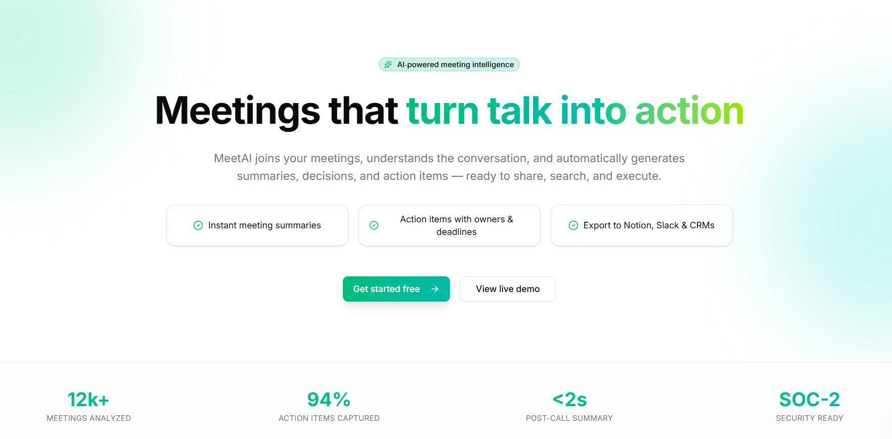
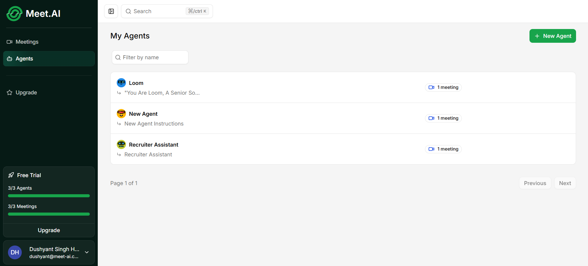
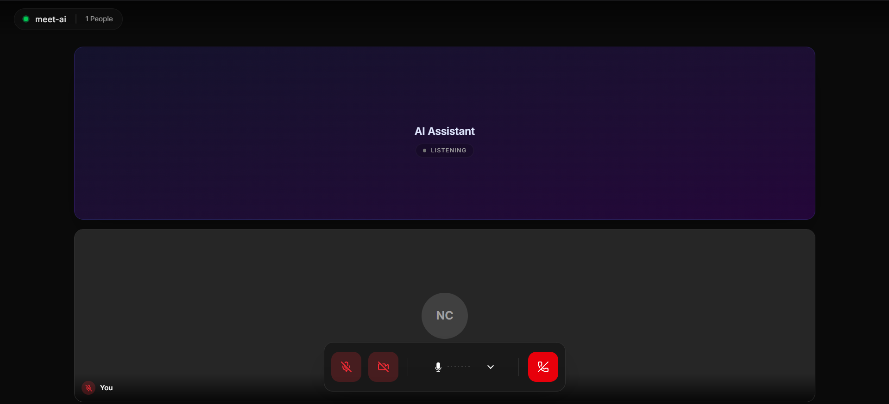

<div align="center">
  

  <h1>MeetAI</h1>

  <p>
    <strong>AI-powered meeting assistant</strong> — real-time voice AI agents, live transcription,<br/>
    intelligent summaries, and in-meeting tool calling, all in one platform.
  </p>

  <p>
    
    
    
    
    
    
  </p>
</div>

---

## What is MeetAI?

MeetAI lets you create custom AI agents, invite them to WebRTC video calls, and have them capture real-time transcripts, decisions, and action items. After each session, a durable background pipeline merges the transcript, resolves speaker names, and produces an AI-generated summary — automatically.

**Live demo:** _coming soon_ · **Docs:** [`apps/docs`](./apps/docs)

---

## Screenshots

| Landing | Dashboard |
|---|---|
|  |  |

| Live Call | AI Summary |
|---|---|
|  |  |

---

## Key Features

| Feature | Details |
|---|---|
| 🎙️ **Custom AI Agents** | Define personas with natural-language instructions; each agent attends meetings as a first-class participant |
| 📹 **WebRTC Video Rooms** | SFU-routed audio/video via LiveKit with server-side token gating and noise cancellation |
| 📝 **Live Transcription** | Agent-side speech-to-text broadcast over LiveKit data channels (real-time captions, no DB round-trip) |
| 🤖 **AI Summarization** | Inngest-powered, step-checkpointed pipeline using Gemini 2.5 Flash — runs asynchronously after every call |
| 🛠️ **In-meeting Tool Calling** | Agent creates calendar events mid-call via LiveKit RPC with human-in-the-loop approval |
| 🔗 **Role-gated Invites** | Shareable invite links with host / co-host / attendee / viewer roles and optional expiry |
| 💳 **Subscription Billing** | Polar.sh checkout + portal; free tier capped at 3 agents / 3 meetings |
| 🔐 **Authentication** | Better Auth with GitHub & Google OAuth and email/password; middleware-based session protection |

---

## Tech Stack

| Layer | Technology | Why |
|---|---|---|
| **Framework** | Next.js 15 — App Router, RSC, Server Actions | Full-stack SSR with streaming and server components |
| **Language** | TypeScript (end-to-end) | Type safety from DB schema to UI components |
| **API Layer** | tRPC v11 | Typesafe RPC — no codegen, no REST boilerplate |
| **Real-time** | LiveKit (SFU WebRTC + Agent Framework) | Server-side agents require audio access impossible in P2P mesh |
| **AI Models** | Google Gemini 2.5 Flash | Multimodal live (voice) + text summarization |
| **Database** | Neon (Serverless Postgres) + Drizzle ORM | Scale-to-zero cost model; Drizzle avoids Prisma's cold-start overhead |
| **Background Jobs** | Inngest | Step-level durability: if Gemini fails, only that step retries |
| **Auth** | Better Auth | OAuth + email/password with a simple Polar plugin for billing |
| **Payments** | Polar.sh | Subscription gating with one-line Better Auth integration |
| **Styling** | Tailwind CSS v4 + shadcn/ui + Framer Motion | Utility-first with accessible Radix UI primitives |
| **Monorepo** | Turborepo + npm workspaces | Parallel builds and shared caching across apps |
| **Deployment** | Vercel (web + docs) | Native Next.js support; serverless functions per route |

---

## Architecture Overview

```
User Browser ──(WebRTC)──► LiveKit SFU ──► AI Agent (Node.js)
     │                          │               │
     │ (tRPC / HTTPS)           │ room_finished  │ transcript lines
     ▼                          ▼               ▼
Next.js App Router ──► Inngest ──► Gemini ──► Neon Postgres
       │                                          ▲
       └───────────────── Drizzle ORM ────────────┘
```

**Four data paths:**
1. **Write** — Agent batches 10 transcript lines per HTTP POST → `JSONB array_concat` on the meeting row
2. **Read** — Dashboard RSC → tRPC → Drizzle → single row fetch (no JOIN)
3. **Real-time** — Agent → LiveKit Data Channel → browser (live captions, bypasses DB entirely)
4. **Async** — LiveKit webhook → Inngest event → 4 checkpointed steps → Gemini → Neon

---

## Monorepo Structure

```
meetai-monorepo/
├── apps/
│   ├── web/          # Next.js 15 application (main product)
│   ├── agent/        # Standalone LiveKit AI Agent (Node.js / TypeScript)
│   └── docs/         # Nextra-powered technical documentation site
└── packages/         # Shared packages (reserved for future use)
```

---

## Getting Started

### Prerequisites

- Node.js 20+
- A [Neon](https://neon.tech) Postgres database
- A [LiveKit Cloud](https://livekit.io) project (or self-hosted)
- A [Google AI Studio](https://aistudio.google.com) API key (Gemini)
- A [Polar.sh](https://polar.sh) organisation for billing (optional)

### Install & configure

```bash
# Install all workspace dependencies
npm install

# Copy the example env file and fill in your values
cp apps/web/.env.example apps/web/.env.local   # (see below for required vars)
```

<details>
<summary>Required environment variables (<code>apps/web/.env.local</code>)</summary>

```env
DATABASE_URL=postgresql://...
NEXT_PUBLIC_APP_URL=http://localhost:3000

LIVEKIT_URL=wss://your-livekit-host
LIVEKIT_API_KEY=lk_api_key
LIVEKIT_API_SECRET=lk_api_secret
NEXT_PUBLIC_LIVEKIT_URL=wss://your-livekit-host

GITHUB_CLIENT_ID=...
GITHUB_CLIENT_SECRET=...
GOOGLE_CLIENT_ID=...
GOOGLE_CLIENT_SECRET=...

POLAR_ACCESS_TOKEN=...
GOOGLE_API_KEY=...       # Gemini key for summaries & voice
```

</details>

### Run locally

```bash
# Apply the database schema
npm run db:push --workspace=web

# Start the Next.js app
npm run dev

# In a separate terminal — start the Inngest worker (post-meeting summaries)
npx inngest-cli@latest dev

# In another terminal — start the LiveKit agent
npm run dev --workspace=meetai-agent
```

The web app is available at **http://localhost:3000**.

---

## Notable Engineering Decisions

| Decision | Chosen | Rejected | Reason |
|---|---|---|---|
| **Database** | Neon Serverless Postgres | AWS RDS | Scale-to-zero; no idle cost |
| **ORM** | Drizzle | Prisma | ~50 KB vs ~2 MB — critical for serverless cold starts |
| **Real-time** | LiveKit SFU | Raw P2P WebRTC | P2P has no server node for the AI agent to join |
| **Background jobs** | Inngest | Cron / BullMQ | Step-level retries avoid re-running expensive AI calls |
| **Transcript storage** | JSONB column | Normalised table | Read-optimised; dashboard always loads the full transcript |
| **Transcript writer** | Agent-side | Client-side | `beforeunload` is unreliable; agent lifecycle is deterministic |

See the full [trade-offs & system design documentation](./apps/docs/content/tradeoffs.mdx) for in-depth analysis.

---

## Scripts

| Command | Description |
|---|---|
| `npm run dev` | Start all apps in development mode (Turborepo) |
| `npm run build` | Production build for all apps |
| `npm run lint` | Lint all apps |
| `npm run db:push` | Push Drizzle schema to Neon |
| `npm run db:studio` | Open Drizzle Studio (visual DB browser) |
| `npm run inngest` | Run Inngest worker locally |

---

## License

MIT
