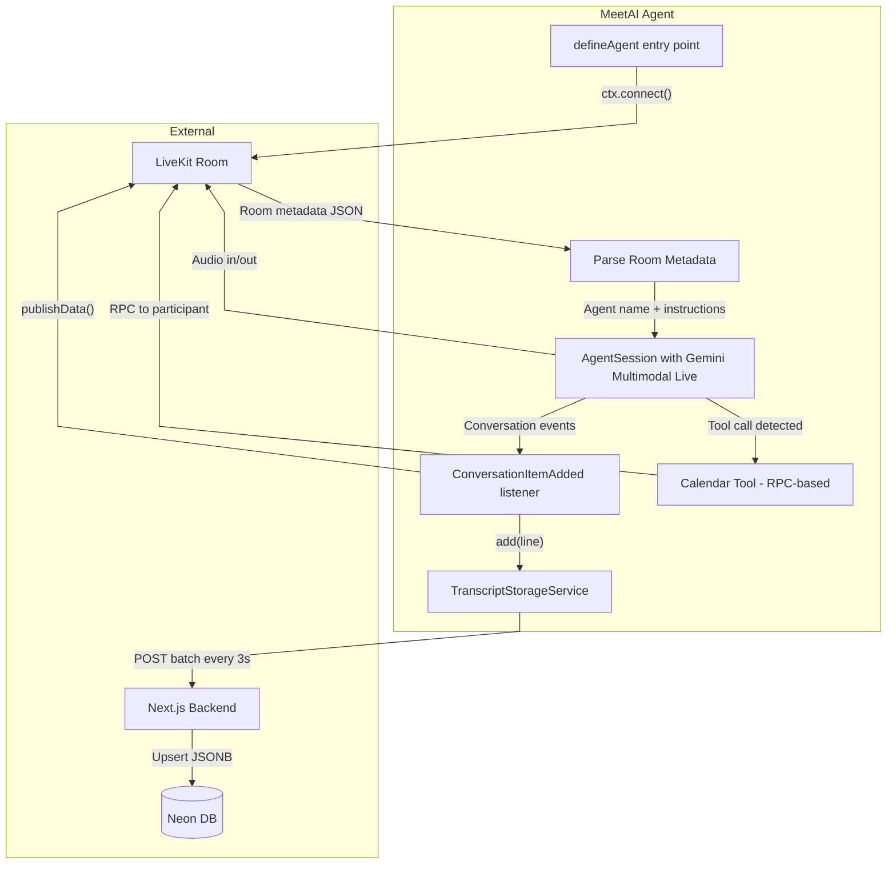
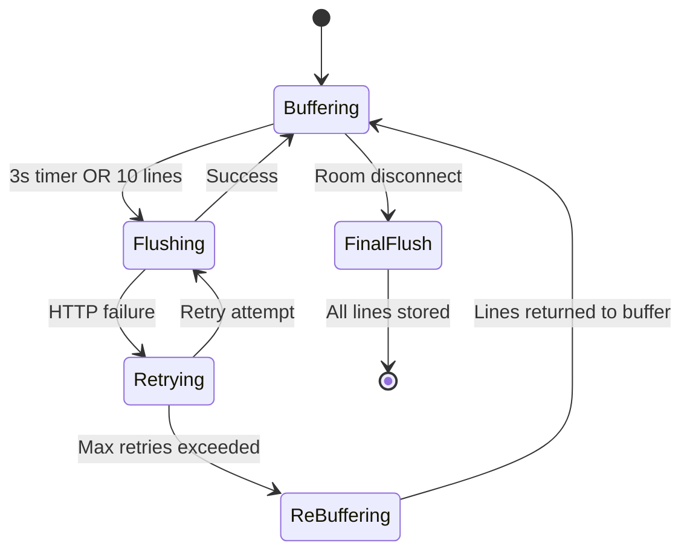

# AI Agent System

import { Callout } from 'nextra/components'

<Callout type="info">
  The MeetAI agent is a **LiveKit Voice Pipeline Agent** — a Dockerized Node.js process that joins LiveKit rooms, processes audio via Gemini, and executes tool calls with human-in-the-loop approval.
</Callout>

## Agent Architecture



## Agent Lifecycle

1. **Dispatch** — LiveKit's agent framework dispatches the agent when a room is created with agent-compatible metadata
2. **Connect** — Agent connects to the room via `ctx.connect()`
3. **Metadata Parse** — Reads room metadata to extract meeting info and custom agent instructions
4. **Session Start** — Creates an `AgentSession` with Gemini Multimodal Live (voice-to-voice)
5. **Conversation Loop** — Listens for `ConversationItemAdded` events and processes each turn
6. **Transcript Storage** — Buffers and batches transcript lines to the backend
7. **Tool Execution** — Handles tool calls (calendar events) via LiveKit RPC
8. **Shutdown** — Flushes remaining transcript buffer on room disconnect

## Custom Instructions

Each agent has user-defined instructions stored in the `agents` table. These are injected into the system prompt at runtime:

```typescript
const finalInstructions = `
  You are a helpful voice AI assistant named ${currentAgent.name}.
  The current meeting name is "${currentMeeting.name}".
  Your Core Instructions: ${currentAgent.instructions}
  IMPORTANT: Default language is English.
`;
```

This allows users to create specialized agents:
- **Standup Bot** — "Focus on blockers and action items"
- **Interview Coach** — "Ask behavioral questions and give feedback"
- **Brainstorm Facilitator** — "Encourage divergent thinking, track all ideas"

## Transcript Storage Service

The `TranscriptStorageService` class handles reliable transcript persistence:



### Configuration

| Parameter | Value | Rationale |
| --- | --- | --- |
| `BATCH_SIZE` | 10 lines | Amortize HTTP overhead without excessive latency |
| `FLUSH_INTERVAL_MS` | 3000ms | Balance between real-time persistence and request volume |
| `MAX_RETRIES` | 3 | Exponential backoff: 1s, 2s, 4s — covers transient network issues |

## Tool Calling — Calendar Events

The calendar tool uses a **RPC-based approval pattern** instead of traditional HTTP webhooks:

### Why RPC over HTTP?

| Aspect | HTTP Webhook | LiveKit RPC |
| --- | --- | --- |
| **Latency** | Agent → Backend → WebSocket → Client | Agent → SFU → Client (direct) |
| **Targeting** | Broadcast to all | Specific participant |
| **Bidirectional** | Needs separate response channel | Request-response built-in |
| **Auth** | Separate token validation | LiveKit session inherent |

### Approval Flow

```typescript
// Agent side: send approval request to specific participant
const response = await ctx.room.localParticipant.performRpc({
  destinationIdentity: targetParticipant,
  method: "approval-request",
  payload: JSON.stringify({ type: "calendar_event", ...eventDetails }),
});

// Client side: registered RPC handler renders approval dialog
// User clicks Approve/Reject → response sent back via RPC
```

<Callout>
  **Concurrency guard:** A `pendingApprovals` Map deduplicates identical in-flight RPC calls keyed by `participantIdentity + eventHash`. This prevents duplicate approval dialogs caused by Gemini speech interruptions re-triggering the same tool call.
</Callout>

## Deployment

The agent runs as a standalone Docker container, separate from the Next.js app:

```dockerfile
FROM node:20-slim
WORKDIR /app
COPY package.json pnpm-lock.yaml ./
RUN corepack enable && pnpm install --frozen-lockfile
COPY . .
RUN pnpm build
CMD ["node", "dist/agent.js", "start"]
```

Environment variables required:
- `LIVEKIT_URL` — LiveKit server WebSocket URL
- `LIVEKIT_API_KEY` / `LIVEKIT_API_SECRET` — Agent authentication
- `GOOGLE_API_KEY` — Gemini API access
- `NEXT_PUBLIC_APP_URL` — Backend URL for transcript storage
- `AGENT_SECRET` — Shared secret for agent → backend auth
