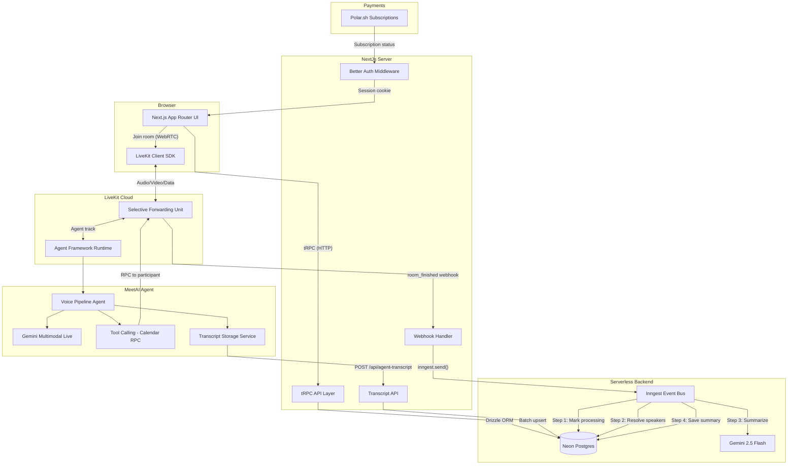
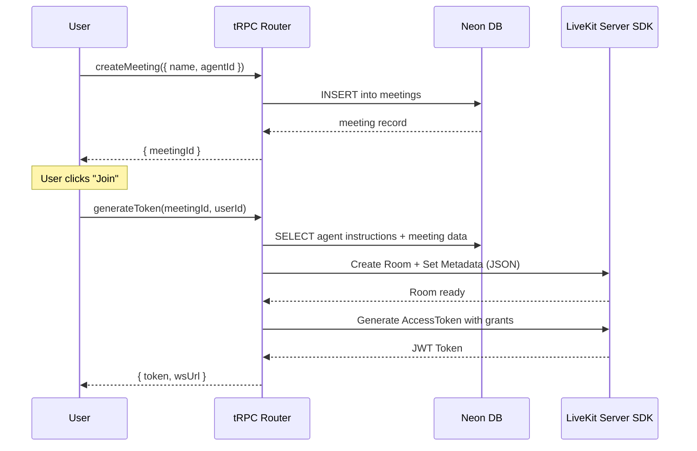
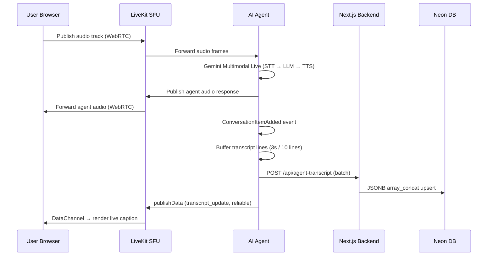
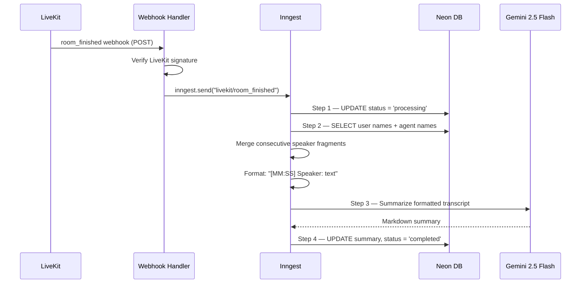

# System Architecture

import { Callout } from 'nextra/components'

<Callout type="info">
  This page maps out the full request lifecycle in MeetAI — from a user clicking "Start Meeting" to receiving an AI-generated summary in their dashboard.
</Callout>

## High-Level Architecture

## Request Lifecycle

### 1. Meeting Creation

### 2. Live Meeting — Audio & Transcript Flow

### 3. Post-Meeting Processing

## Component Responsibilities

| Component | Role | Key Files |
| --- | --- | --- |
| **Next.js App Router** | SSR, API routes, tRPC server | `src/app/`, `src/trpc/` |
| **tRPC** | Typesafe API layer for all CRUD | `src/trpc/routers/` |
| **Better Auth** | OAuth + email auth, session mgmt | `src/lib/auth.ts`, `src/middleware.ts` |
| **LiveKit Server SDK** | Room creation, token generation | `src/lib/stream-video.ts` |
| **LiveKit Agent** | Voice AI pipeline, tool calling | `meetai-agent/src/agent.ts` |
| **Inngest** | Event-driven post-meeting processing | `src/inngest/functions.ts` |
| **Drizzle ORM** | Typesafe DB queries over Neon | `src/db/schema.ts`, `src/db/index.ts` |
| **Polar.sh** | Subscription billing, premium gating | `src/lib/polar.ts` |

## Data Flow Summary

1. **Write path**: Agent → HTTP POST → Next.js API → Drizzle → Neon (transcript lines batched every 3s)
2. **Read path**: Dashboard → tRPC → Drizzle → Neon → React Server Components
3. **Real-time path**: Agent → LiveKit Data Channel → Browser (live captions, no DB round-trip)
4. **Async path**: LiveKit webhook → Inngest event → Durable function steps → Gemini → Neon
