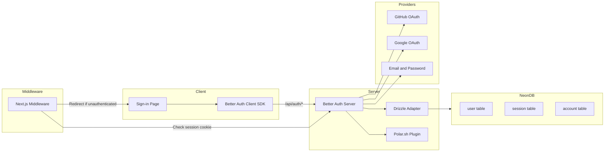

# Authentication

import { Callout } from 'nextra/components'

<Callout type="info">
  MeetAI uses **Better Auth** — a framework-agnostic authentication library with first-class Drizzle ORM integration, OAuth providers, and plugin support for payments.
</Callout>

## Auth Architecture



## Providers

| Provider | Type | Flow |
| --- | --- | --- |
| **GitHub** | OAuth 2.0 | `GITHUB_CLIENT_ID` / `GITHUB_CLIENT_SECRET` |
| **Google** | OAuth 2.0 | `GOOGLE_CLIENT_ID` / `GOOGLE_CLIENT_SECRET` |
| **Email** | Credential | `emailAndPassword: { enabled: true }` |

## Middleware Protection

The Next.js middleware (`src/middleware.ts`) implements cookie-based session checking:

```typescript
// Check for session token across cookie name variants
const hasToken =
  request.cookies.has("session_token") ||
  request.cookies.has("__Secure-session_token") ||
  request.cookies.has("better-auth.session_token") ||
  request.cookies.has("__Secure-better-auth.session_token");
```

### Route Protection Rules

| Route Pattern | Access | Reasoning |
| --- | --- | --- |
| `/` | Public | Landing page |
| `/_next/*`, `/api/*`, static files | Public | Framework assets |
| `/sign-in`, `/sign-up` | Public (redirects if authed) | Auth pages |
| `/agents/*`, `/meetings/*`, `/upgrade` | Protected | Dashboard routes |
| `/call/*` | Protected | Meeting rooms |

## Polar.sh Integration

Better Auth's Polar plugin enables subscription gating:

```typescript
plugins: [
  polar({
    client: polarClient,
    createCustomerOnSignUp: true,  // Auto-create Polar customer
    use: [
      checkout({ authenticatedUsersOnly: true, successUrl: "/upgrade" }),
      portal(),  // Customer self-service portal
    ],
  }),
],
```

<Callout>
  **How it works:** When a user signs up, Polar automatically creates a customer record. The `checkout` sub-plugin restricts purchase flows to authenticated users. The `portal` sub-plugin gives users access to manage their subscription.
</Callout>

## Database Tables

Better Auth manages four tables through the Drizzle adapter:

- **`user`** — Core identity (id, name, email, image)
- **`session`** — Active sessions with token, expiry, IP, user-agent
- **`account`** — Linked OAuth providers (GitHub, Google) per user
- **`verification`** — Email verification tokens

All foreign keys cascade on delete — removing a user automatically cleans up sessions, accounts, and all related meeting data.
