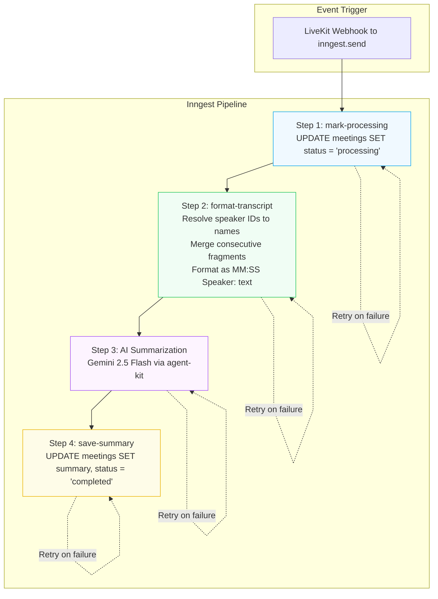

# Background Jobs — Inngest

import { Callout } from 'nextra/components'

<Callout type="info">
  MeetAI uses **Inngest** for event-driven, durable background processing — specifically for post-meeting transcript formatting and AI summarization.
</Callout>

## Why Inngest?

Inngest provides **durable functions** — multi-step workflows where each step is individually retried and checkpointed. If step 3 fails, it retries from step 3, not from step 1.

This is critical for MeetAI because the summarization pipeline involves:
1. A database write (mark meeting as "processing")
2. A database read + complex transformation (resolve speaker names, merge fragments)
3. An external AI API call (Gemini — can be slow or flaky)
4. A final database write (save summary)

Without durable steps, a Gemini timeout would force re-running the entire pipeline.

## Pipeline Architecture



## Step-by-step Breakdown

### Step 1: Mark Processing

```typescript
const meeting = await step.run("mark-processing", async () => {
  const [meeting] = await db.update(meetings)
    .set({
      status: "processing",
      startedAt: startedAt ? new Date(startedAt) : undefined,
      endedAt: endedAt ? new Date(endedAt) : undefined,
    })
    .where(eq(meetings.id, meetingId))
    .returning();

  meeting.transcript.sort((a, b) => a.timestamp - b.timestamp);
  return meeting;
});
```

<Callout>
  Setting `status = "processing"` immediately prevents the dashboard from showing stale data. Users see a "Processing..." indicator instead of an empty summary.
</Callout>

### Step 2: Format Transcript

This step performs **smart merge** of consecutive speaker fragments:

```
// Before merge:
[10:01] User: "I want to..."
[10:02] User: "know about APIs."

// After merge:
[10:01] User: "I want to... know about APIs."
```

It also resolves speaker IDs to human-readable names by batch-querying the `user` and `agents` tables in parallel:

```typescript
const [users, agentRows] = await Promise.all([
  db.select({ id: userTable.id, name: userTable.name })
    .from(userTable)
    .where(inArray(userTable.id, speakerIds)),
  db.select({ id: agents.id, name: agents.name })
    .from(agents)
    .where(inArray(agents.id, speakerIds))
]);
```

### Step 3: AI Summarization

Uses `@inngest/agent-kit` with Gemini 2.5 Flash. The system prompt enforces a structured markdown output:

```markdown
### Overview
Detailed, engaging summary of the session...

### Notes
Thematic sections with timestamp ranges (e.g., 05:00 - 10:00)
```

### Step 4: Save Summary

```typescript
await step.run("save-summary", async () => {
  await db.update(meetings)
    .set({
      summary: aiResponse,
      transcript: meeting.transcript,  // original (un-merged) for accuracy
      status: "completed",
    })
    .where(eq(meetings.id, meetingId));
});
```

<Callout type="warning">
  **Subtle detail:** The *merged* transcript is sent to Gemini for better summaries, but the *original* un-merged transcript is saved to the database for playback accuracy. This is an intentional dual-representation design.
</Callout>

## Event Schema

```typescript
// Event sent from webhook handler
{
  name: "livekit/room_finished",
  data: {
    meetingId: string,   // nanoid meeting ID
    startedAt: number,   // epoch ms
    endedAt: number,     // epoch ms
  }
}
```

## Inngest Dev Server

During local development, Inngest provides a dev server with a visual dashboard:

```bash
npx inngest-cli@latest dev
```

This allows inspecting event payloads, step execution logs, and retry behavior without deploying to production.

## Failure Modes & Recovery

| Failure | Inngest Behavior | User Impact |
| --- | --- | --- |
| Gemini API timeout | Step 3 retries (exponential backoff) | Summary delayed, not lost |
| Neon DB connection drop | Steps 1/2/4 retry individually | Transparent to user |
| Invalid transcript (empty) | Early return with `{ success: false }` | Meeting marked complete, no summary |
| Partial step completion | Resumes from last failed step | No duplicate processing |
