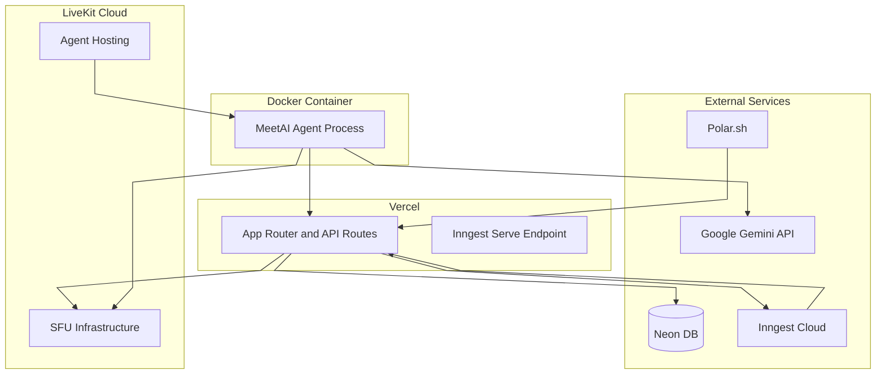

# Deployment

import { Callout } from 'nextra/components'

<Callout type="info">
  MeetAI is deployed as two independent services: the **Next.js app** on Vercel and the **AI Agent** as a Docker container on LiveKit Cloud (or any container runtime).
</Callout>

## Deployment Architecture



## Environment Variables

### Next.js App (Vercel)

| Variable | Purpose |
| --- | --- |
| `DATABASE_URL` | Neon DB connection string |
| `LIVEKIT_URL` | LiveKit server WebSocket URL |
| `LIVEKIT_API_KEY` | LiveKit API key |
| `LIVEKIT_API_SECRET` | LiveKit API secret |
| `GITHUB_CLIENT_ID` / `GITHUB_CLIENT_SECRET` | GitHub OAuth |
| `GOOGLE_CLIENT_ID` / `GOOGLE_CLIENT_SECRET` | Google OAuth |
| `GOOGLE_API_KEY` | Gemini API for summarization |
| `INNGEST_SIGNING_KEY` | Inngest webhook verification |
| `POLAR_ACCESS_TOKEN` | Polar.sh API access |
| `BETTER_AUTH_SECRET` | Auth session encryption |
| `AGENT_SECRET` | Shared secret for agent → backend auth |

### AI Agent (Docker)

| Variable | Purpose |
| --- | --- |
| `LIVEKIT_URL` | LiveKit server WebSocket URL |
| `LIVEKIT_API_KEY` | LiveKit API key |
| `LIVEKIT_API_SECRET` | LiveKit API secret |
| `GOOGLE_API_KEY` | Gemini Multimodal Live API |
| `NEXT_PUBLIC_APP_URL` | Backend URL for transcript storage |
| `AGENT_SECRET` | Shared secret for agent → backend auth |

## Local Development

```bash
# Terminal 1 — Next.js dev server
cd meetai
npm run dev

# Terminal 2 — Inngest dev server
cd meetai
npx inngest-cli@latest dev

# Terminal 3 — LiveKit agent (development mode)
cd meetai-agent
npx tsx src/agent.ts dev

# Terminal 4 — ngrok tunnel (for LiveKit webhooks)
ngrok http 3000
```

<Callout>
  The Inngest dev server provides a local dashboard at `http://localhost:8288` where you can inspect events, step execution, and retry behavior. Run it alongside the Next.js dev server during development.
</Callout>

## Database Migrations

```bash
# Push schema changes to Neon DB
npm run db:push    # drizzle-kit push

# Open Drizzle Studio (visual DB browser)
npm run db:studio  # drizzle-kit studio
```

Drizzle Kit uses "push" mode (not migration files) for direct schema synchronization. This is suitable for development and small teams. For production, consider switching to `drizzle-kit generate` + `drizzle-kit migrate` for versioned migration files.
