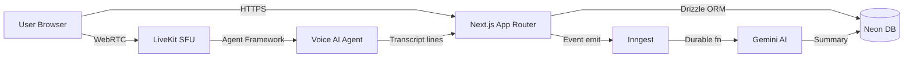

# MeetAI — Technical Documentation

import { Cards, Callout } from 'nextra/components'

<Callout type="info">
  **MeetAI** is a production-grade, AI-powered meeting assistant featuring real-time voice AI agents, live transcription, intelligent summarization, and in-meeting tool calling — built entirely on modern serverless infrastructure.
</Callout>

## What is MeetAI?

MeetAI enables users to create AI agents with custom instructions, join WebRTC video calls alongside those agents, and receive real-time transcription, post-meeting summaries, and AI-triggered actions (calendar events, emails) — all from a single dashboard.

## Tech Stack at a Glance

| Layer               | Technology                                                    |
| ------------------- | ------------------------------------------------------------- |
| **Framework**       | Next.js 16 (App Router, RSC, Server Actions)                 |
| **Real-time**       | LiveKit (SFU-based WebRTC, Agent Framework)                  |
| **Database**        | Neon DB (Serverless Postgres) + Drizzle ORM                  |
| **Auth**            | Better Auth (GitHub, Google OAuth + email/password)           |
| **Background Jobs** | Inngest (event-driven, durable functions)                    |
| **AI Models**       | Google Gemini 2.5 Flash (summarization + voice)              |
| **Payments**        | Polar.sh (subscription gating)                               |
| **API Layer**       | tRPC (end-to-end typesafe RPCs)                              |
| **Styling**         | Tailwind CSS + shadcn/ui                                     |

## Key Features

- **Custom AI Agents** — Users define agent personas with natural-language instructions
- **Live WebRTC Meetings** — SFU-routed audio/video via LiveKit with noise cancellation
- **Real-time Transcription** — Agent-side speech-to-text broadcast over LiveKit data channels
- **AI Summarization** — Inngest-powered post-meeting summary generation using Gemini
- **Tool Calling** — In-meeting calendar event creation with human-in-the-loop approval via RPC
- **Invite System** — Role-gated invite links with expiry for co-host/attendee access
- **Premium Tier** — Polar.sh subscription integration via Better Auth plugin

## Architecture Overview

## Documentation Map

<Cards>
  <Cards.Card title="Architecture" href="/architecture" />
  <Cards.Card title="Database Schema" href="/database" />
  <Cards.Card title="Real-time Engine" href="/real-time" />
  <Cards.Card title="Background Jobs" href="/background-jobs" />
  <Cards.Card title="AI Agent System" href="/agent-system" />
  <Cards.Card title="Authentication" href="/auth" />
  <Cards.Card title="Trade-offs & System Design" href="/tradeoffs" />
  <Cards.Card title="Deployment" href="/deployment" />
</Cards>
