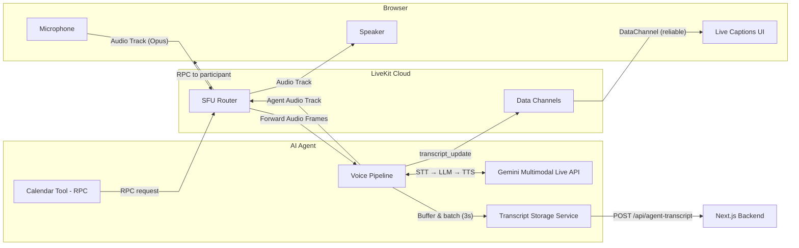
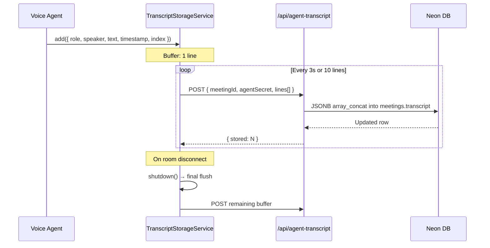
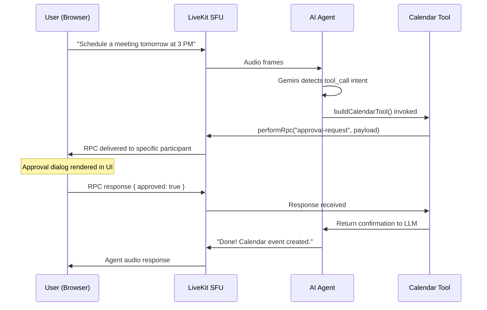

# Real-time Engine — LiveKit

import { Callout } from 'nextra/components'

<Callout type="info">
  MeetAI uses **LiveKit** as its real-time engine — an open-source, SFU-based WebRTC platform that handles audio/video routing, agent hosting, and data channel communication.
</Callout>

## Why LiveKit?

LiveKit provides three critical capabilities in a single platform:

1. **SFU (Selective Forwarding Unit)** — Routes media tracks between participants without transcoding, enabling low-latency N-way calls
2. **Agent Framework** — Runs server-side AI agents that can join rooms, receive audio, and publish responses
3. **Data Channels** — Reliable/unreliable data messaging for real-time transcript broadcast

## Architecture



## Token Generation

The server generates LiveKit JWTs via `livekit-server-sdk`. Each token includes:

- **Room name** = meeting ID
- **Participant identity** = user ID (for speaker resolution)
- **Participant name** = display name
- **Room metadata** = JSON payload with meeting data + agent instructions

```typescript
// src/lib/stream-video.ts (simplified)
const roomService = new RoomServiceClient(
  process.env.LIVEKIT_URL!,
  process.env.LIVEKIT_API_KEY!,
  process.env.LIVEKIT_API_SECRET!
);

// Room metadata carries agent configuration
await roomService.createRoom({
  name: meetingId,
  metadata: JSON.stringify({
    meetingData: { id: meeting.id, name: meeting.name },
    agentData: { name: agent.name, instructions: agent.instructions },
  }),
});

const token = new AccessToken(apiKey, apiSecret, {
  identity: userId,
  name: userName,
});
token.addGrant({ room: meetingId, roomJoin: true, canPublish: true });
```

<Callout>
  Room metadata is set at creation time and read by the agent on connect. This avoids a separate DB fetch from the agent process, keeping the agent stateless and environment-agnostic.
</Callout>

## Transcript Flow (Agent → DB)

The agent uses a `TranscriptStorageService` class that:

1. **Buffers** transcript lines in memory
2. **Auto-flushes** every 3 seconds OR when 10 lines accumulate (whichever comes first)
3. **Retries** with exponential backoff (up to 3 attempts)
4. **Re-buffers** on failure (lines are not lost)



<Callout type="warning">
  **Dual-write pattern:** The agent simultaneously (a) publishes transcript updates over the LiveKit data channel for instant UI rendering, and (b) batches them to the backend for persistent storage. The data channel path has zero DB latency; the storage path ensures durability.
</Callout>

## Tool Calling via RPC

The agent supports in-meeting tool calling using LiveKit's **RPC (Remote Procedure Call)** mechanism instead of traditional HTTP webhooks.

### Calendar Event Flow



Key design choices:

- **Targeted delivery** — The AI specifies which participant should receive the approval popup
- **Concurrency-safe** — A `pendingApprovals` Map deduplicates identical in-flight RPC calls (prevents double-popups from speech interruptions)
- **Human-in-the-loop** — Users can approve, reject, or modify the proposed event before execution

## Webhook Integration

When a LiveKit room finishes, LiveKit sends a `room_finished` webhook to `/api/webhooks/livekit`. This endpoint:

1. Validates the webhook signature using `WebhookReceiver`
2. Extracts the room name (= meeting ID) and timestamps
3. Fires an Inngest event to trigger async post-processing

```typescript
// Webhook → Inngest bridge
await inngest.send({
  name: "livekit/room_finished",
  data: { meetingId, startedAt, endedAt },
});
```
