# Trade-offs & System Design

import { Callout } from 'nextra/components'

<Callout type="info">
  Each section covers a key architectural decision, the alternatives considered, and the reasoning behind the chosen approach — including what was rejected and why.
</Callout>

---

## 1. Serverless Postgres (Neon) vs. Traditional RDS

### The Decision

MeetAI uses **Neon DB** (serverless Postgres) instead of a traditional managed RDS instance (e.g., AWS RDS, DigitalOcean Managed Postgres).

### Why Neon?

| Factor | Neon DB (Serverless) | Traditional RDS |
| --- | --- | --- |
| **Cold start** | ~100ms connection via HTTP driver | Always-on, 0ms (but you pay 24/7) |
| **Scale-to-zero** | Yes — $0 when idle | No — minimum ~$15/mo even idle |
| **Connection model** | HTTP-based pooling (`@neondatabase/serverless`) | Persistent TCP connections (pool exhaustion risk) |
| **Branching** | Git-like DB branches for preview deploys | Manual snapshot/restore |
| **Vercel integration** | Native — env vars auto-provisioned | Manual setup |
| **Cost at low scale** | Free tier: 0.5 GB, generous compute | $15-50/mo minimum |

### The Deeper Trade-off

<Callout type="warning" emoji="🎯">
  The fundamental trade-off is **latency predictability vs. cost efficiency**. Neon's serverless driver (HTTP-based) adds ~10-30ms per query compared to a persistent TCP connection. For MeetAI, this is acceptable because:

  1. **Transcript writes** are batched (10 lines per HTTP call) — the per-line overhead is amortized
  2. **Dashboard reads** are server-rendered (RSC) — the DB latency is hidden in the page render
  3. **Real-time captions** don't touch the DB at all — they flow through LiveKit data channels

  The only latency-sensitive DB operation is the post-meeting summarization pipeline, which runs asynchronously via Inngest — users never wait for it.
</Callout>

### Connection Architecture

```typescript
// src/db/index.ts — Using the serverless driver with pool support
import { Pool } from '@neondatabase/serverless';
import { drizzle } from 'drizzle-orm/neon-serverless';

const pool = new Pool({ connectionString: process.env.DATABASE_URL });
export const db = drizzle(pool); // Supports transactions
```

<Callout emoji="💡">
  **Why `Pool` instead of `neon()` HTTP driver?** The `Pool` driver maintains a WebSocket-based connection pool that supports **transactions** — needed for multi-step operations like creating a meeting + adding the host as a participant atomically. The plain `neon()` HTTP driver is stateless and doesn't support transactions.
</Callout>

### When Would RDS Be Better?

- **Sub-5ms query requirements** — e.g., a real-time multiplayer game leaderboard
- **Heavy write throughput** — e.g., IoT sensor data at 10K writes/sec
- **Complex long-running transactions** — e.g., financial systems with distributed locks
- **Predictable, always-on traffic** — no benefit from scale-to-zero

---

## 2. SFU (LiveKit) vs. Raw WebRTC (Peer-to-Peer)

### The Decision

MeetAI uses **LiveKit's SFU architecture** instead of establishing direct peer-to-peer WebRTC connections between participants.

### P2P vs. SFU vs. MCU


| Aspect | P2P (Mesh) | SFU (LiveKit) | MCU |
| --- | --- | --- | --- |
| **Upload streams** | N-1 per user | 1 per user | 1 per user |
| **Server CPU** | None | Low (forwarding only) | High (transcoding) |
| **Scalability** | 4-5 users max | 100+ users | 50+ users |
| **Latency** | Lowest (direct) | Low (1 hop) | Higher (transcode delay) |
| **AI agent access** | Impossible (no server) | Native (agent joins room) | Possible but complex |
| **Cost** | $0 server | $$ (SFU infra) | $$$ (CPU-intensive) |

<Callout type="warning" emoji="🎯">
  The deciding factor for MeetAI wasn't just scalability — it was **AI agent integration**. In a P2P mesh, there's no server-side entity that can receive audio streams, process them through an LLM, and inject responses back. LiveKit's SFU provides a first-class Agent Framework where server-side agents are treated as regular room participants. This is architecturally impossible with pure P2P WebRTC.
</Callout>

### Why Not MCU?

An MCU (Multipoint Control Unit) could also host agents, but it **transcodes** all streams into a single mixed output. This means:

1. **Higher latency** — transcode adds 200-500ms
2. **Higher cost** — CPU-intensive video mixing
3. **Loss of per-track control** — the agent can't isolate individual speakers for accurate transcription
4. **No selective subscription** — all participants get the same mixed stream

<Callout emoji="💡">
  **Follow-up Answer:** "An SFU forwards individual tracks without transcoding. This means the AI agent receives each participant's audio as a separate stream, enabling accurate per-speaker transcription. An MCU would mix all audio into one stream, making speaker diarization significantly harder."
</Callout>

### LiveKit-Specific Advantages

- **Agent Framework** — First-class support for server-side agents with audio pipeline
- **Data Channels** — Reliable/unreliable data messaging (used for live captions)
- **RPC Mechanism** — Targeted request-response between agent and specific participants
- **Room Metadata** — JSON payload attached to rooms, read by agents on connect
- **Webhook System** — `room_finished` events trigger post-processing pipelines

---

## 3. Event-driven Queues (Inngest) vs. Cron Jobs

### The Decision

MeetAI uses **Inngest's event-driven durable functions** instead of cron-based polling for post-meeting AI processing.

### The Fundamental Difference

```mermaid
%%{init: {'flowchart': {'curve': 'linear'}}}%%
flowchart TB
    subgraph Cron Approach
        Cron["⏰ Cron: every 60s"] --> Poll["SELECT * FROM meetings<br/>WHERE status = 'active'<br/>AND endedAt IS NOT NULL"]
        Poll --> Process["Process meeting"]
        Poll --> Nothing["No meetings → wasted query"]
    end

    subgraph Event Driven Inngest
        Webhook["LiveKit room_finished webhook"] --> Event["inngest.send - livekit/room_finished"]
        Event --> Durable["Durable function executes<br/>Steps retry independently"]
    end
```



| Aspect | Cron Jobs | Inngest (Event-driven) |
| --- | --- | --- |
| **Trigger** | Time-based polling | Event-based (instant reaction) |
| **Latency** | 0-60s delay (depends on cron interval) | ~100ms after event |
| **Wasted work** | Polls even when nothing changed | Only runs when events fire |
| **Retry granularity** | Entire job retries from scratch | Individual steps retry |
| **Observability** | Roll your own logging | Built-in dashboard, step traces |
| **Concurrency** | Manual locking (DB flags, Redis) | Handled by Inngest runtime |
| **Idempotency** | Manual implementation | Step-level deduplication |

<Callout type="warning" emoji="🎯">
  The killer feature of Inngest isn't just event-driven execution — it's **step-level durability**. The summarization pipeline has 4 steps:

  1. Mark meeting as "processing" (DB write)
  2. Format transcript (DB read + transform)
  3. Call Gemini API (external, slow, flaky)
  4. Save summary (DB write)

  If Step 3 (Gemini API) fails after 30 seconds, a cron job would re-run **all 4 steps** — including the potentially expensive DB reads. Inngest resumes from **Step 3 only**, because Steps 1-2 are checkpointed.
</Callout>

### Why Not a Simple Queue (BullMQ, SQS)?

A basic message queue solves the "don't poll" problem but doesn't provide:

| Feature | BullMQ / SQS | Inngest |
| --- | --- | --- |
| **Step-level checkpointing** | No — entire job retries | Yes |
| **Built-in dashboard** | BullMQ Board (separate) | Yes (dev + prod) |
| **Serverless-native** | Needs a worker process | Runs on your existing server |
| **No infrastructure** | Redis / SQS setup required | Hosted service (or self-host) |
| **Type-safe events** | Manual schema validation | TypeScript event schemas |

<Callout emoji="💡">
  **Follow-up Answer:** "The distinction is between a *queue* (BullMQ) and a *workflow engine* (Inngest). A queue delivers a message and retries the consumer. A workflow engine breaks the consumer into individually retriable steps with checkpoint semantics. For multi-step AI pipelines where one step can take 30+ seconds and fail, step-level retry is essential."
</Callout>

### Cost Comparison at MeetAI Scale

Assuming ~500 meetings/month (small SaaS):

| Solution | Monthly Cost | Operational Overhead |
| --- | --- | --- |
| Cron + Vercel Serverless | $0 (Vercel free tier) | High (manual retries, logging, locking) |
| BullMQ + Redis (Upstash) | ~$10 (Redis) + worker hosting | Medium (Redis ops, worker management) |
| **Inngest (hosted)** | **$0 (free tier: 5K runs)** | **Low (zero infra, built-in dashboard)** |

---

## 4. Drizzle ORM vs. Prisma

### The Decision

MeetAI uses **Drizzle ORM** instead of Prisma for database access.

| Aspect | Drizzle | Prisma |
| --- | --- | --- |
| **Query style** | SQL-like (relational) | Object-based (ActiveRecord-like) |
| **Bundle size** | ~50KB | ~2MB (engine binary) |
| **Cold start impact** | Minimal | +300-500ms (engine init) |
| **Serverless fit** | Excellent | Poor (engine overhead) |
| **Schema definition** | TypeScript (code-first) | `.prisma` DSL (separate language) |
| **Type inference** | From schema code directly | Generated client (`prisma generate`) |
| **Edge runtime** | Full support | Limited (edge-compatible client separate) |

<Callout type="warning" emoji="🎯">
  In a Vercel serverless environment, every cold start pays the cost of initializing the ORM. Prisma's query engine binary adds 300-500ms to cold starts. Drizzle is a thin TypeScript layer that adds negligible overhead. For an app like MeetAI with frequent serverless invocations (API routes, server components, webhooks), this difference compounds significantly.
</Callout>

---

## 5. JSONB Transcript vs. Normalized Table

### The Decision

Transcript data is stored as a **JSONB array** on the `meetings` row instead of a separate `transcript_lines` table.

| Approach | JSONB Column | Normalized Table |
| --- | --- | --- |
| **Read pattern** | Single row fetch = full transcript | JOIN or separate query with pagination |
| **Write pattern** | Array concat (`jsonb_set`) | INSERT per line |
| **Query individual lines** | Not indexed (full scan) | Indexed columns |
| **Data co-location** | With meeting (cache-friendly) | Separate table (extra I/O) |
| **Schema flexibility** | Schemaless within JSONB | Rigid column types |

<Callout type="warning" emoji="🎯">
  This is a classic **read-optimized vs. write-optimized** trade-off. MeetAI's access pattern is overwhelmingly read-heavy:
  - **Write:** Agent batches 10 lines per HTTP call → `jsonb_set` array concat (amortized)
  - **Read:** Dashboard always loads full transcript → single row fetch (no JOIN)

  A normalized `transcript_lines` table would add a JOIN for every transcript render and create N rows per meeting (potentially thousands). JSONB keeps the data co-located and avoids the N+1 problem entirely.
</Callout>

### When to Normalize Instead

- **Full-text search on individual lines** — JSONB `@>` operators are slower than GIN-indexed text columns
- **Per-line metadata updates** — e.g., marking lines as "action items" independently
- **Cross-meeting transcript search** — "Find all meetings where I discussed 'API design'"

---

## 6. Agent-side Transcript Storage vs. Client-side Buffering

### The Decision

Transcript lines are stored from the **agent process** (server-side), not from the user's browser (client-side).


| Factor | Client-side | Agent-side |
| --- | --- | --- |
| **Reliability** | `beforeunload` is unreliable (tab crash, mobile) | Agent lifecycle is controlled |
| **Data completeness** | Misses lines if client disconnects | Agent sees all conversation turns |
| **Security** | Client can tamper with transcript | Agent is trusted server-side process |
| **Ordering** | Race conditions across multiple clients | Single source of truth (sequential index) |
| **Battery/bandwidth** | Client resources consumed for storage | Offloaded to agent server |

<Callout type="warning" emoji="🎯">
  "I moved transcript storage from client-side to agent-side because the `beforeunload` event is fundamentally unreliable for data persistence. On mobile browsers, tab switches can kill the page without firing the event. The agent process has a deterministic lifecycle — it can flush its buffer in the `shutdown()` handler, which executes before the process exits. This changed our transcript loss rate from ~5% to effectively 0%."
</Callout>

---

## Summary: Decision Matrix

| Decision | Chose | Over | Primary Reason |
| --- | --- | --- | --- |
| **Database** | Neon (Serverless Postgres) | RDS, PlanetScale | Scale-to-zero cost model, Vercel integration |
| **Real-time** | LiveKit (SFU) | Raw WebRTC P2P | AI agent integration requires server-side audio access |
| **Background Jobs** | Inngest | Cron, BullMQ | Step-level durability for multi-step AI pipelines |
| **ORM** | Drizzle | Prisma | Serverless cold start performance, bundle size |
| **Transcript Storage** | JSONB column | Normalized table | Read-optimized for dashboard pattern |
| **Transcript Writer** | Agent-side | Client-side | Reliability of server-side lifecycle vs. `beforeunload` |
